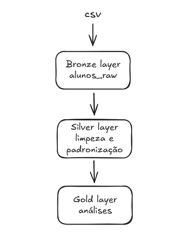
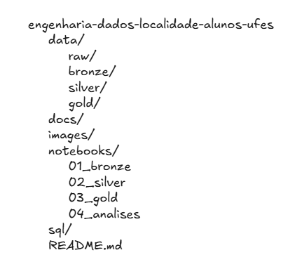
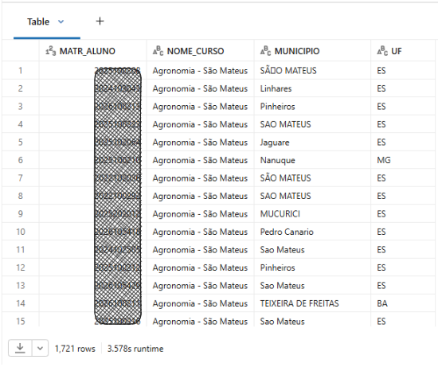
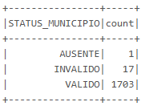
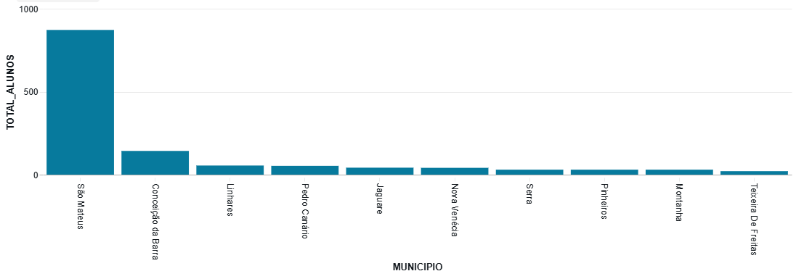
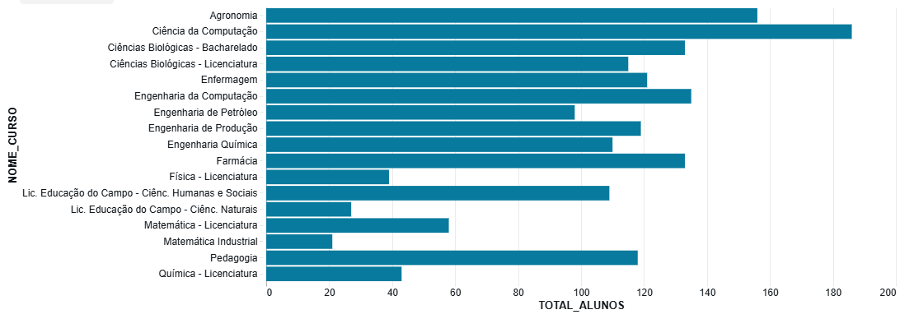
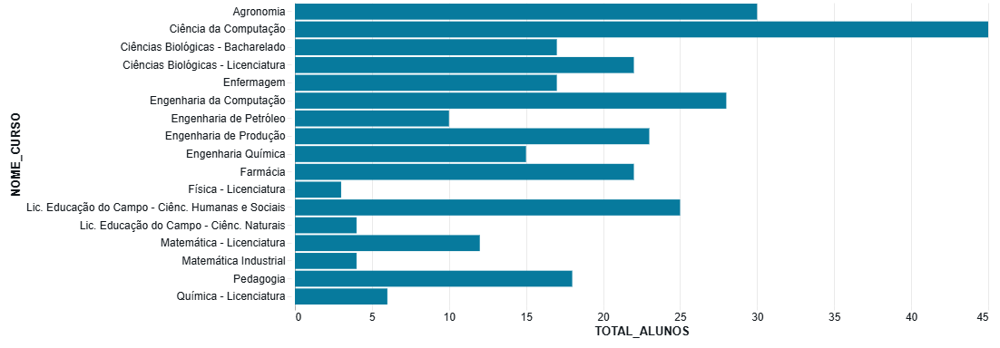
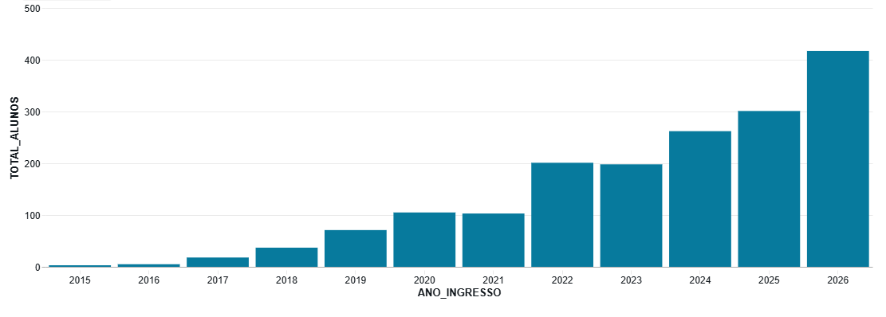
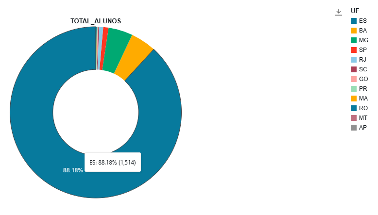
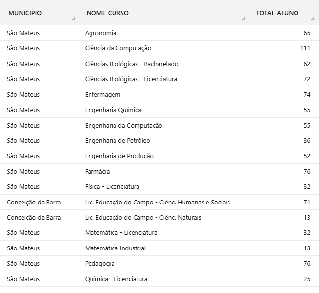

# Engenharia de Dados - Localidade dos Alunos UFES

## 📌 Objetivo do Projeto

Este projeto tem como objetivo desenvolver um pipeline de Engenharia de Dados utilizando informações de localidade dos alunos da Universidade Federal do Espírito Santo (UFES).

A partir de um arquivo CSV contendo dados de matrícula, curso, município e estado dos estudantes, foi construído um fluxo completo de dados utilizando a arquitetura em camadas **Bronze, Silver e Gold**, seguindo boas práticas utilizadas em ambientes profissionais de Engenharia de Dados.

O projeto realiza a ingestão, tratamento, padronização e transformação dos dados, disponibilizando informações estruturadas para análises sobre distribuição geográfica dos alunos, cursos e evolução dos ingressantes ao longo dos anos.

Apesar de ser uma base de dados muito pequena (cerca de 2000 alunos), o objetivo é aprender as ferramentas com uma base pequena para eu conseguir validar se estava fazendo corretamente e com uma base real de dados onde atuo como bolsista.

---

## 🏗 Arquitetura do Projeto

O pipeline foi desenvolvido utilizando o conceito de **Medallion Architecture**, uma arquitetura amplamente utilizada em plataformas de dados modernas.

A organização das camadas é:Dados Brutos (CSV) -> Bronze Layer -> Silver Layer -> Gold Layer -> Análises

Cada camada possui uma responsabilidade específica:

### 🥉 Bronze

Responsável pela ingestão dos dados originais, mantendo uma cópia estruturada do arquivo de origem.

### 🥈 Silver

Responsável pela limpeza e preparação dos dados, incluindo:

### 🥇 Gold

Responsável pela criação das tabelas analíticas utilizadas para responder perguntas de negócio.

---

## 🛠 Tecnologias Utilizadas

As principais tecnologias utilizadas no desenvolvimento deste projeto foram:

- **Databricks**: plataforma utilizada para processamento distribuído, desenvolvimento dos notebooks e gerenciamento das tabelas Delta.
- **Apache Spark (PySpark)**: utilizado para processamento, transformação e análise dos dados.
- **Delta Lake**: utilizado para armazenamento das tabelas nas camadas Bronze, Silver e Gold.
- **Git e GitHub**: utilizados para versionamento do código, documentação e acompanhamento da evolução do projeto.
- **Python**: linguagem utilizada para desenvolvimento das transformações de dados utilizando PySpark.

---

# 🔄 Projeto

## 🥉 Bronze Layer
O arquivo de origem utilizado foi um CSV contendo informações de localização dos alunos, com as seguintes colunas:

- `MATR_ALUNO`: identificação da matrícula do aluno;
- `NOME_CURSO`: curso de graduação;
- `MUNICIPIO`: município informado pelo aluno;
- `UF`: estado informado pelo aluno.

Nesta etapa, os dados foram carregados utilizando PySpark no Databricks e armazenados em uma tabela Delta:

## 🥈 Silver Layer

Nesta etapa foram realizadas as seguintes transformações:

- ajuste dos tipos de dados das colunas;
- identificação e tratamento de problemas de codificação dos caracteres;
- padronização dos nomes dos municípios;
- criação de uma tabela de correção para municípios com diferentes representações;
- classificação da qualidade dos registros.

Foi criada a coluna:

`STATUS_MUNICIPIO`

com três possíveis valores:
- VALIDO: Município identificado e padronizado
- INVALIDO: Município não encontrado ou inconsistente
- AUSENTE: Registro sem município informado

Após o tratamento, os dados foram armazenados na tabela Delta:

---

## 🥇 Gold Layer

Nesta etapa, os dados foram agregados com o objetivo de gerar informações consolidadas sobre a distribuição dos alunos, permitindo análises relacionadas a municípios, cursos, estados e períodos de ingresso.

Foram criadas tabelas Delta contendo métricas que podem ser utilizadas para consultas analíticas e geração de visualizações.

### Tabelas analíticas desenvolvidas

| Tabela | Descrição |
|---|---|
| `alunos_por_municipio` | Quantidade total de alunos por município de origem. |
| `alunos_por_curso` | Quantidade total de alunos agrupados por curso. |
| `alunos_por_estado` | Distribuição dos alunos por estado (UF). |
| `alunos_por_ano` | Quantidade de alunos agrupados pelo ano de ingresso obtido a partir da matrícula. |
| `top_municipio_por_curso` | Identificação dos municípios com maior quantidade de alunos em cada curso. |
| `alunos_2025_curso` | Quantidade de alunos matriculados em cada curso em 2025. |

### Transformações realizadas

As principais operações realizadas na camada Gold foram:

- agrupamento dos dados por diferentes dimensões de análise;
- cálculo da quantidade de alunos utilizando funções de agregação;
- criação de métricas para suporte à análise exploratória;
- filtragem de registros inválidos antes da geração das métricas;
- organização dos resultados em tabelas Delta.

---

# 📊 Análises Realizadas

Em seguida, foram realizadas análises exploratórias utilizando as tabelas analíticas geradas na camada Gold.

## 🗺 Alunos por Município

Foi analisada a distribuição dos alunos de acordo com o município informado na base de dados.

A partir da tabela alunos_por_municipio foi possível identificar os municípios com maior concentração de alunos:
- São Mateus;
- Conceição da Barra;
- Linhares;
- Pedro Canário;
- Jaguare.

## 🎓 Alunos por Curso

Também foi realizada uma análise da quantidade de alunos por curso de graduação.

Essa análise permite identificar quais cursos possuem maior quantidade de estudantes cadastrados na base.

Tabela utilizada:alunos_por_curso

O curso com mais alunos atualmente é Ciência da Computação, Agronomia e Engenharia da Computação, mas por esse gráfico não é possível saber se é meu aumento de procura ou retenção de alunos.

## 🌎 Alunos ingressantes por curso em 2025

Para saber quais cursos mais receberam ingressantes em 2025, foi analisada a tabela alunos_2025_curso.
Foi utilizado o ano de 2025 pois alguns cursos começam no 2º semestre do ano, portanto não temos todos para 2026.

É possível ver que os 3 cursos com mais alunos são também os com mais ingressantes em 2025, evidenciando a alta da a´rea tecnológica e de Agronomia.

## 📅 Alunos por Ano de Ingresso

O ano de ingresso foi obtido a partir da matrícula dos alunos.

Como a matrícula possui o ano de entrada como parte do identificador, foi realizada a extração dessa informação para criação de uma nova dimensão temporal.

Essa análise permite observar a distribuição dos ingressantes ao longo dos anos.

Tabela utilizada: alunos_por_ano

Podemos ver um crescimento natural, visto que alunos mais antigos ou se formaram ou saíram da universidade.

## 🌎 Alunos por Estado

Foi analisada a distribuição dos alunos considerando a UF de origem.

Essa análise permite observar a presença de estudantes provenientes de diferentes estados brasileiros.

Tabela utilizada: alunos_por_estado

É possível ver que o Espírito Santo e estados vizinhos são de onde mais vêm os estudantes.

## 🌎 Cidades com mais alunos em cada cursos

Ao olhar as top cidades com mais alunos em cada curso, temos:

Tabela utilizada: top_municipio_por_curso

---

# 📚 Aprendizados

Este projeto permitiu que eu aplicasse conceitos fundamentais de Engenharia de Dados, incluindo:

- arquitetura Medallion;
- processamento distribuído com Apache Spark;
- manipulação de DataFrames com PySpark;
- armazenamento em tabelas Delta;
- tratamento de qualidade de dados;
- versionamento utilizando Git;
- documentação de projetos de dados.

